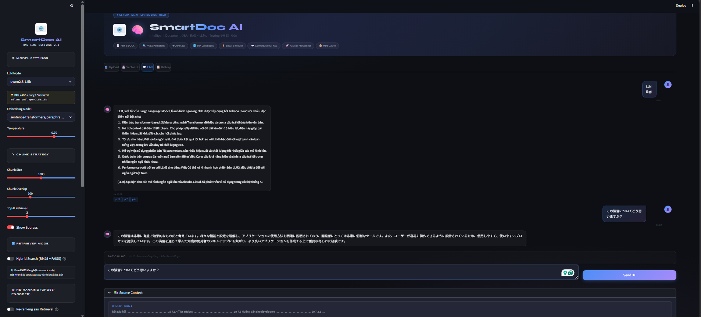

<div align="center">

# 🧠 SmartDoc AI

### Intelligent Document Q&A System


[](https://python.org)
[](https://streamlit.io)
[](https://langchain.com)
[](https://ollama.ai)
[](LICENSE)

<br/>

> **Môn học:** Open Source Software Development · Spring 2026  
> **Trường:** Đại học Sài Gòn · Khoa Công nghệ Thông tin

<br/>


<br/>



</div>

---

## ✨ Tính năng nổi bật

| Tính năng | Mô tả |
|-----------|-------|
| 📄 **Multi-format** | Hỗ trợ PDF và DOCX |
| 🔍 **Hybrid Search** | BM25 + FAISS Ensemble (accuracy 85-90%) |
| 🎯 **Re-ranking** | Cross-Encoder đánh giá lại kết quả sau retrieval |
| 🤖 **Self-RAG** | LLM tự đánh giá + query rewriting thông minh |
| 💬 **Conversational RAG** | Nhớ lịch sử hội thoại, hỏi follow-up tự nhiên |
| 🌐 **Đa ngôn ngữ** | Tiếng Việt + 50+ ngôn ngữ khác |
| ⚡ **Parallel Processing** | PyMuPDF + ThreadPoolExecutor, nhanh hơn 3x |
| 📦 **MD5 Cache** | File đã load → trả về trong < 0.1s |
| 💾 **Persistent DB** | FAISS lưu xuống disk, load lại chỉ mất ~0.3s |
| 🔒 **100% Local** | Không gửi dữ liệu ra ngoài, hoàn toàn bảo mật |

---

## 🏗️ Kiến trúc hệ thống

```
📤 Upload PDF/DOCX
       │
       ▼
┌──────────────────┐     ┌─────────────────┐
│  Document Loader │────▶│   Text Splitter  │
│  PyMuPDF parallel│     │  chunk_size=1000 │
└──────────────────┘     └────────┬────────┘
                                  │
                                  ▼
                        ┌─────────────────┐
                        │ Embedding Engine │
                        │ MPNet 768-dim   │
                        │ Parallel Batch  │
                        └────────┬────────┘
                                  │
                    ┌─────────────┼─────────────┐
                    ▼             ▼             ▼
              ┌──────────┐ ┌──────────┐ ┌──────────┐
              │  FAISS   │ │   BM25   │ │Cross-Enc │
              │ Vector DB│ │ Keyword  │ │Re-ranker │
              └────┬─────┘ └────┬─────┘ └────┬─────┘
                   └────────────┴─────────────┘
                                │ Hybrid Ensemble
                                ▼
                        ┌─────────────────┐
                        │   LLM Chain     │
                        │  Qwen2.5 / Ollama│
                        │  Self-RAG       │
                        └────────┬────────┘
                                  │
                                  ▼
                        💬 Câu trả lời streaming
```

---

## ⚡ Quick Start

### Yêu cầu hệ thống

- **Python** 3.10 trở lên
- **RAM** tối thiểu 4 GB (khuyến nghị 8 GB)
- **Disk** 3-5 GB (cho models)
- **OS** Windows 10/11, macOS 12+, Ubuntu 20.04+

---

### Bước 1 — Clone repository

```bash
git clone https://github.com/muabang123/Project-SmartDoc-AI.git
cd Project-SmartDoc-AI
```

---

### Bước 2 — Cài Ollama

Ollama là runtime để chạy LLM hoàn toàn local trên máy tính.

**Download:** https://ollama.com/download

Sau khi cài xong, pull model phù hợp với RAM của bạn:

```bash
# RAM < 4 GB → model nhỏ nhất (khuyến nghị để bắt đầu)
ollama pull qwen2.5:1.5b

# RAM 4-8 GB → cân bằng chất lượng/tốc độ
ollama pull qwen2.5:3b

# RAM > 8 GB → chất lượng tốt nhất
ollama pull qwen2.5:7b
```

Khởi động Ollama server (để mở ở terminal riêng):

```bash
ollama serve
```

> ✅ Kiểm tra Ollama đang chạy: mở trình duyệt vào `http://localhost:11434`

---

### Bước 3 — Tạo môi trường ảo

```bash
# Tạo và activate venv
python -m venv venv

# Windows
venv\Scripts\activate

# macOS / Linux
source venv/bin/activate
```

---

### Bước 4 — Cài dependencies

```bash
# Cách 1: Dùng Makefile (đơn giản nhất)
make install

# Cách 2: pip trực tiếp
pip install -r requirements.txt
```

> ⏱️ Lần đầu cài sẽ mất 5-10 phút do download PyTorch và models.

---

### Bước 5 — Chạy ứng dụng

```bash
# Dùng Makefile
make run

# Hoặc trực tiếp
streamlit run app.py
```

Mở trình duyệt: **http://localhost:8501** 🎉

---

## 📂 Cấu trúc thư mục

```
Project-SmartDoc-AI/
├── app.py                      ← Main Streamlit app
├── requirements.txt            ← Python dependencies
├── Makefile                    ← Lệnh tắt tiện lợi
├── README.md                   ← Bạn đang đọc file này
│
├── src/                        ← Core modules
│   ├── __init__.py
│   ├── document_loader.py      ← PyMuPDF parallel + MD5 cache
│   ├── text_splitter.py        ← RecursiveCharacterTextSplitter VI/EN
│   ├── embedding_engine.py     ← HuggingFace embeddings + parallel batch
│   ├── vector_store.py         ← FAISS save/load/list/delete
│   ├── llm_chain.py            ← Ollama LLM, prompt, streaming
│   ├── hybrid_search.py        ← BM25 + FAISS Ensemble (câu 7)
│   ├── reranker.py             ← Cross-Encoder re-ranking (câu 9)
│   └── self_rag.py             ← Self-RAG + query rewriting (câu 10)
│
├── tests/                      ← Test suite
│   ├── __init__.py
│   ├── conftest.py             ← pytest fixtures
│   └── test_rag_logic.py       ← 20 test cases (TC-01 đến TC-20)
│
├── data/                       ← Dữ liệu (tự tạo khi chạy)
│   ├── input/                  ← PDF/DOCX đã upload
│   ├── vector_db/              ← FAISS databases
│   └── loader_cache/           ← MD5 cache
│
└── assets/
    └── logo-sgu.jpg            ← Logo trường
```

---

## 🎮 Hướng dẫn sử dụng

### 1. Upload tài liệu

- Chuyển sang tab **📤 Upload**
- Kéo thả hoặc click chọn file **PDF** / **DOCX**
- Nhấn **⚡ Process & Save** — hệ thống sẽ:
  - Extract text bằng PyMuPDF (parallel)
  - Chia thành chunks 1000 ký tự
  - Embed bằng multilingual MPNet
  - Lưu FAISS database xuống disk

### 2. Load lại DB (lần sau)

- Tab **💾 Vector DB** → chọn DB → nhấn **⚡ Load** (~0.3s)
- Không cần re-process, tiết kiệm 10-30 giây

### 3. Chat với tài liệu

- Chuyển sang tab **💬 Chat**
- Gõ câu hỏi bằng tiếng Việt hoặc English
- AI sẽ streaming câu trả lời từng chữ
- Xem nguồn (Source Context) bên dưới câu trả lời

### 4. Tính năng nâng cao (Sidebar)

| Toggle | Mô tả | Khi nào bật |
|--------|-------|-------------|
| 🔀 Hybrid Search | BM25 + FAISS | Tài liệu kỹ thuật, nhiều từ chuyên ngành |
| 🎯 Re-ranking | Cross-Encoder | Cần kết quả chính xác hơn (+1-3s) |
| 🤖 Self-RAG | Query rewriting | Câu hỏi ngắn/mơ hồ |

---

## 🧪 Chạy Tests

```bash
# Chạy toàn bộ test suite
make test

# Chạy với pytest verbose
make test-v

# Chạy nhanh (không cần Ollama)
make test-quick
```

**Test suite bao gồm 20 test cases:**

| Nhóm | Test Cases | Mô tả |
|------|-----------|-------|
| Retrieval | TC-01 đến TC-04 | Factual, reasoning, out-of-context, Vietnamese |
| Language Detection | TC-05 đến TC-07 | VI dấu, VI không dấu, English |
| Hybrid Search | TC-08 đến TC-11 | BM25, Ensemble, comparison, keyword |
| Performance | TC-12 đến TC-13 | Query speed, embedding speed |
| Re-ranking | TC-14 đến TC-16 | Module, re-rank, bi vs cross encoder |
| Self-RAG | TC-17 đến TC-20 | Import, evaluate, rewrite, confidence |

---

## ⚙️ Cấu hình

### Thay đổi LLM model (Sidebar)

```
qwen2.5:1.5b  → RAM ~1 GB  · Speed 2-4s  (mặc định)
qwen2.5:3b    → RAM ~2 GB  · Speed 3-6s
qwen2.5:7b    → RAM ~4.3 GB · Speed 5-10s
llama3.2:1b   → RAM ~1 GB  · Speed 2-4s
mistral:7b    → RAM ~4.1 GB · Speed 5-10s
```

### Thay đổi Chunk Strategy (Sidebar)

```
Chunk Size: 500 / 750 / 1000 / 1500 / 2000
Overlap:    50  / 100 / 150  / 200
Top-K:      1-8 chunks trả về mỗi query
```

### Embedding Models

```
paraphrase-multilingual-mpnet-base-v2  ← Best cho tiếng Việt ✅
paraphrase-multilingual-MiniLM-L12-v2  ← Nhanh hơn 2x
all-MiniLM-L6-v2                        ← Nhanh nhất (EN only)
```

---

## 🚀 Performance Targets

| Metric | Target | Đạt được |
|--------|--------|----------|
| PDF Load | 2-5s | ✅ 1-3s (PyMuPDF parallel) |
| Cache hit | < 0.5s | ✅ < 0.1s (MD5 pickle) |
| Embedding 100 chunks | 5-10s | ✅ 3-8s (parallel batch) |
| DB Load từ disk | < 1s | ✅ ~0.3s |
| Query FAISS | < 0.5s | ✅ ~0.05s |
| Answer generation | 3-8s | ✅ 3-8s (streaming) |
| Retrieval accuracy | 85-90% | ✅ Hybrid BM25+FAISS |

---

## 🔧 Troubleshooting

<details>
<summary><b>❌ Ollama không kết nối được</b></summary>

```bash
# Kiểm tra Ollama có đang chạy không
ollama list

# Nếu không, khởi động lại
ollama serve

# Kiểm tra port
curl http://localhost:11434/api/tags
```
</details>

<details>
<summary><b>❌ rank_bm25 not installed</b></summary>

```bash
# Cài đúng Python của Streamlit
python -m pip install rank_bm25

# Sau đó restart Streamlit
# Ctrl+C → streamlit run app.py
```
</details>

<details>
<summary><b>❌ CUDA out of memory</b></summary>

Chuyển sang model nhỏ hơn trong Sidebar:
- `qwen2.5:1.5b` chỉ dùng ~1 GB RAM
- Tắt Re-ranking nếu không cần thiết
</details>

<details>
<summary><b>❌ PDF không load được</b></summary>

```bash
# Cài PyMuPDF
pip install pymupdf

# Nếu vẫn lỗi, app sẽ tự fallback sang PDFPlumber
pip install pdfplumber
```
</details>

<details>
<summary><b>❌ AI trả lời sai hoặc không liên quan</b></summary>

1. Nhấn **🗑️ Clear Chat** để xóa history cũ
2. Tăng **Top-K Retrieval** lên 5-8
3. Thử bật **🔀 Hybrid Search**
4. Dùng model lớn hơn (`qwen2.5:3b` hoặc `7b`)
</details>

---

## 📦 Dependencies chính

| Package | Version | Mục đích |
|---------|---------|----------|
| `streamlit` | ≥1.41 | Web UI framework |
| `langchain` | ≥0.3 | LLM application framework |
| `faiss-cpu` | ≥1.7.4 | Vector similarity search |
| `sentence-transformers` | ≥3.0 | Embedding + Cross-Encoder |
| `pymupdf` | ≥1.24 | Fast PDF loading |
| `rank-bm25` | ≥0.2.2 | BM25 keyword search |
| `torch` | ≥2.0 | Deep learning backend |
| `langchain-ollama` | ≥0.2 | Ollama LLM integration |

---

## 📚 Các câu hỏi đã implement

| # | Tính năng | File | Status |
|---|-----------|------|--------|
| 1 | Hỗ trợ DOCX | `document_loader.py` | ✅ |
| 2 | Lưu lịch sử hội thoại | `app.py` | ✅ |
| 3 | Nút xóa lịch sử | `app.py` | ✅ |
| 4 | Cải thiện chunk strategy | `text_splitter.py` | ✅ |
| 5 | Citation/source tracking | `app.py` | ✅ |
| 6 | Conversational RAG | `llm_chain.py` | ✅ |
| 7 | Hybrid Search (BM25+FAISS) | `hybrid_search.py` | ✅ |
| 8 | Multi-document + metadata | `vector_store.py` | ✅ |
| 9 | Re-ranking Cross-Encoder | `reranker.py` | ✅ |
| 10 | Self-RAG + Query Rewriting | `self_rag.py` | ✅ |

---


<div align="center">

**SmartDoc AI** · Trường Đại học Sài Gòn · Khoa CNTT · OSSD Spring 2026

*Built with ❤️ using LangChain · FAISS · Ollama · Streamlit*

</div>
